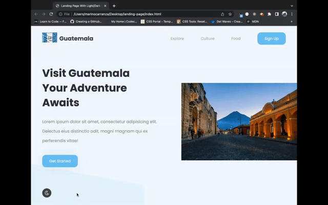

# **Landing Page**
Entrance to the site, with three links to basic information.

## **Description**
This page provides an easy and comprehensive way to find activities a user might be interested in doing while visiting Guatemala.

## **Technologies Used**
•  HTML

•  CSS

•  Javascript

## **What it looks like**

## **How to Use This Page**
Wheater the user is using a desktop computer or a mobile device, there are links taking them to different pages detailing the kinds of activities that can be enjoyed while visitin Guatemala.
The icon on the bottom left of the page toggles the page from light to dark theme and viceversa.

## **Credits**
I followed True Coder's YouTube video tutorial to build this page; I was particularly interested in the media queries and hamburger menu.

## **Roadmap**
My main interests was the layout of the page but I am considering adding functionality to the buttons, for now I am satisfiec with how it looks.

## **Collaborations**
Please feel free to let me know if you have suggestions or opinions about this project, you can reach me at marino.carranza@gmail.com